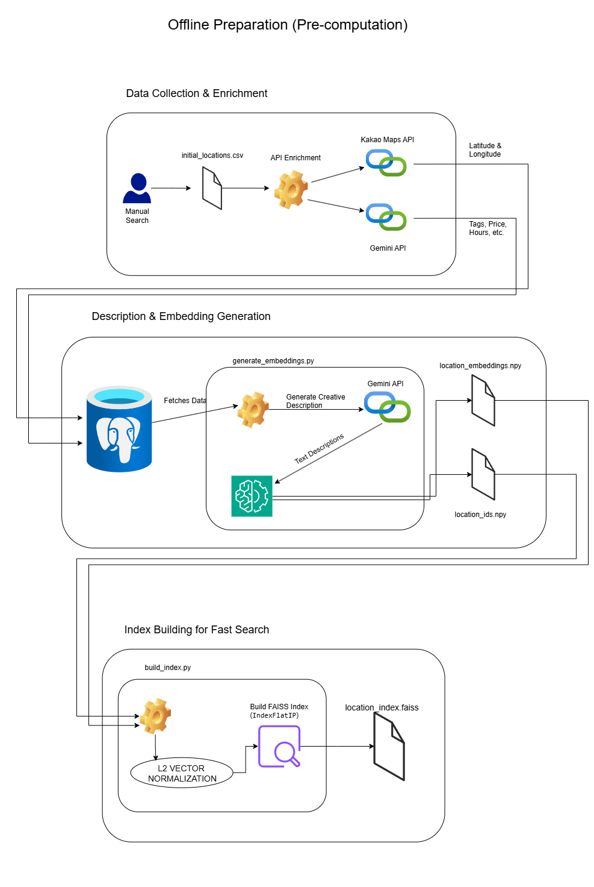
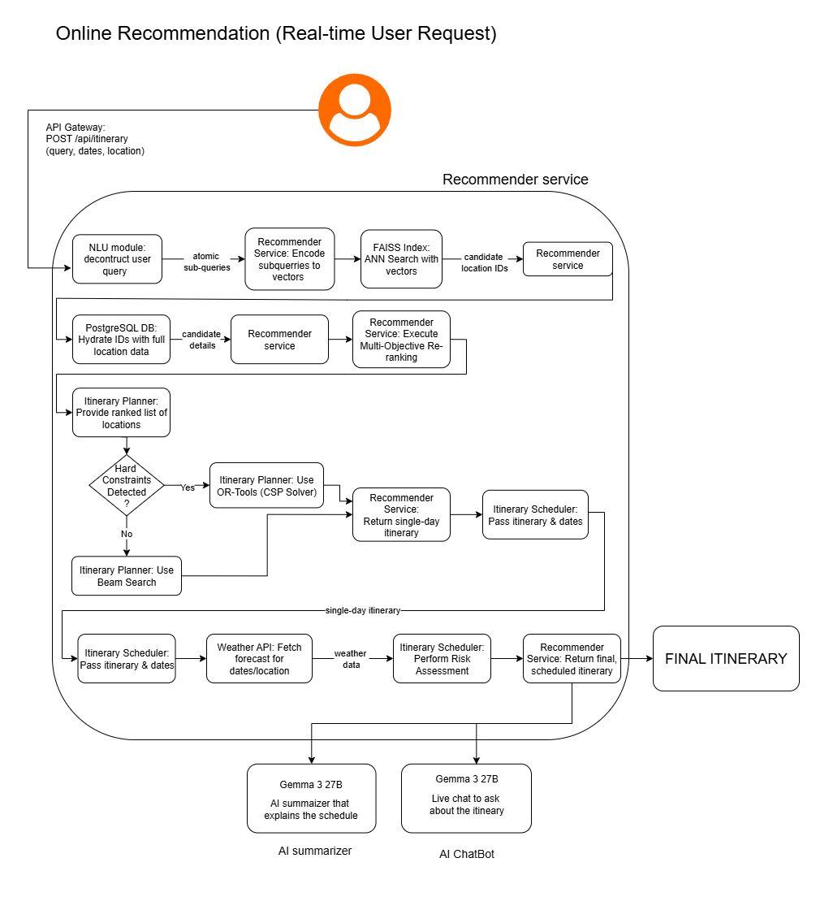
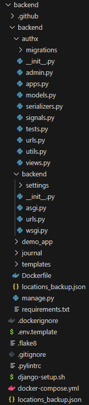
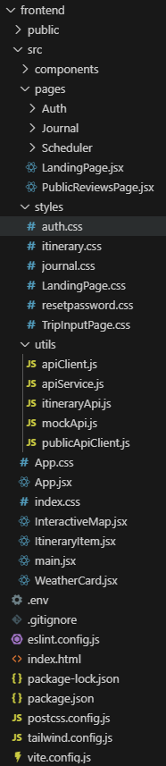
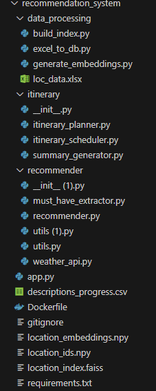

[](https://classroom.github.com/a/nRcUn8vA)

# AI-Powered Personalized Itinerary Generation Web Application

An intelligent travel planning assistant that generates personalized, adaptive, and logistically sound itineraries based on natural language queries. This project moves beyond generic "Top 10" lists to create truly unique travel experiences.

---

## Background (프로젝트 배경)

### Market Situation & Problem Statement

Traditional travel planning is often a frustrating and inefficient process. Existing platforms like TripAdvisor or Expedia typically provide static, one-size-fits-all recommendations that fail to consider a user's unique preferences, real-time conditions like weather, or logistical coherence. This leads to common problems:

* **Information Overload**: Users must manually sift through hundreds of generic reviews to find places that match a specific vibe (e.g., a "quiet, cozy cafe").
* **Manual Curation Burden**: Users are responsible for the difficult initial discovery phase of finding a set of activities that are not only interesting but also located conveniently near each other.
* **Lack of Context**: Recommendations are often static and unaware of dynamic factors. A platform might suggest an outdoor park during a rainstorm or fail to mention a limited-time local festival.

### Necessity & Expected Impact

This project was born from the need to solve these issues by creating a truly personalized, adaptive, and intelligent travel planning assistant.The expected impact is a revolutionary travel planning experience where users can receive a practical, enjoyable, and customized itinerary in seconds, eliminating hours of manual research and preventing common travel frustrations like inefficient travel between locations.Our system promotes a more immersive and eco-friendly way to travel by creating walkable daily plans.

---

## Goals (개발 목표)

### Overall Objective & Features

The primary goal was to create a holistic, end-to-end travel planning ecosystem. This was broken down into two main components:

1.  **A Comprehensive User Application**: A secure and responsive web app built with React, featuring a full authentication system, user profiles, and the ability to create and share personal travel journals and reviews.
2.  **An AI Recommendation & Itinerary Service**: A powerful backend service that can:
    * Achieve a deep semantic understanding of a user's free-text travel queries. 
    * Generate dynamic recommendations ranked by semantic similarity, weather, operating hours, and proximity.
    * Automatically assemble recommendations into coherent, walkable daily schedules by clustering activities.
    * Satisfy non-negotiable user requests (e.g., "I must visit this museum") using constraint optimization.

### Differentiation vs. Similar Services

| Platform | Common Limitation | Our Solution |
| :--- | :--- | :--- |
| **TripAdvisor** | Recommendations are based on broad popularity, not personal context.| **Deep Semantic Understanding:** Our AI understands the nuance behind queries like "quiet and cozy," matching it to rich, AI-generated location descriptions. |
| **Wanderlog** | The initial discovery and logistical clustering of places is left to the user.| **Automated Discovery & Clustering:** Our system proactively discovers the best cluster of relevant places in a single neighborhood, creating an optimal itinerary from scratch. |
| **Expedia** | "Things to Do" sections are static and context-unaware (e.g., suggesting a park in the rain). | **Dynamic & Time-Sensitive:** Our system integrates live weather data to provide warnings and recommends timely events like festivals or concerts.|

### Social value / sustainability aspects

---

## System Design (시스템 설계)

### Architecture Diagram

Our system is split into two main phases: an **Offline Preparation Phase** for data processing and a **Real-time Online Recommendation Phase** to handle user requests.

**1. Offline Data Processing & Indexing**

This phase transforms raw location data into a highly optimized format for semantic search.
1.  **Data Enrichment**: Raw location data is enriched using the Kakao Maps API (for coordinates) and Google Gemini API (for generating rich, descriptive paragraphs).
2.  **Embedding Generation**: The AI-generated descriptions are converted into 384-dimension numerical vectors (embeddings) using Sentence Transformers.
3.  **Vector Indexing**: The embeddings are indexed using Facebook AI Similarity Search (FAISS) for near-instantaneous search. We use an `IndexFlatIP` optimized for cosine similarity.




**2. Online Real-Time Recommendation Engine**

This is the live FastAPI microservice that generates itineraries.
1.  **Query Deconstruction**: A complex user query is broken down into semantic chunks (e.g., "luxurious italian restaurant," "jazz club").
2.  **Candidate Retrieval**: FAISS retrieves the top-k most semantically similar locations for each sub-query.
3.  **Multi-Factor Reranking**: Candidates are scored and filtered based on geographic cohesion to ensure a walkable itinerary. A final score is calculated based on semantic similarity, distance, and operating hours.
4.  **Itinerary Optimization**: A hybrid planner assembles the final schedule. A Beam Search heuristic is used by default, while Google OR-Tools (CP-SAT solver) is activated to satisfy "must-have" requests.
5.  **Finalization & Delivery**: The itinerary is checked against weather data. The structured plan is sent immediately to the user via WebSocket, followed by an AI-generated summary paragraph from the Gemma 3 API.




### Technologies Used

| Category | Technology | Purpose |
| :--- | :--- | :--- |
| **Frontend** | React, Vite, Tailwind CSS, Material UI | Building a responsive, modern, and intuitive single-page application (SPA). |
| **Backend** | Django, Django Rest Framework | Core application logic, user authentication (JWT), database management, and REST APIs for journals/reviews. |
| **AI Service** | FastAPI | High-performance, asynchronous microservice for handling AI-intensive recommendation tasks. |
| **Database** | PostgreSQL | Relational database for storing user data, locations, trips, and journals. |
| **AI & ML** | Sentence Transformers, FAISS, Google OR-Tools | Semantic search, high-speed vector indexing, and constraint satisfaction for itinerary optimization. |
| **LLMs / APIs**| Google Gemini, OpenAI Gemma 3, OpenWeatherMap | AI-powered data enrichment, itinerary summarization, and real-time weather data. |

---

## Results (개발 결과)

### Overall System Flow

The final platform provides a seamless user experience. A guest user can visit the landing page and immediately generate an itinerary by providing a natural language query. Registered users gain access to a full dashboard where they can manage their profiles, create detailed travel journals with photo uploads, and write reviews. The system successfully generates high-quality, relevant, and logistically sound itineraries with an average latency of ~5-10 seconds.

### Detailed Feature Descriptions

#### Core User Platform (Django & React)

* **Full Authentication System**: Provides a secure and complete user experience, including registration, **JWT-based login**, password management, and detailed user profiles. A full password reset flow allows users to receive a reset link via email.
* **Travel Journals & Reviews**: Authenticated users can create, manage, and share personal travel journals complete with photo uploads. The platform also features a review system where users can leave public feedback, with permissions ensuring only the original author can edit or delete their own content.
* **Guest User Experience**: The landing page is designed to engage users immediately, allowing guest users to try the core itinerary generation feature without needing to sign up, lowering the barrier to entry.

#### AI-Powered Itinerary Engine (FastAPI)

* **Semantic Query Understanding**: The engine moves beyond simple keywords to interpret the intent and ambiance of a user's free-text query. It uses **Sentence Transformers** to understand abstract concepts like "a quiet, cozy cafe to read a book".
* **AI Data Enrichment**: In an offline process, the system uses the **Google Gemini API** to generate rich, descriptive paragraphs for each location. This creates a high-quality semantic target that captures the unique atmosphere of each place.
* **High-Speed Semantic Search**: All location descriptions are converted into numerical vectors and indexed using **Facebook AI Similarity Search (FAISS)**. This enables near-instantaneous, meaning-based search over the entire database.
* **Multi-Factor Reranking**: After retrieving initial candidates, the system re-ranks them using a sophisticated formula that prioritizes **geographic cohesion** (to create walkable itineraries), semantic similarity, and whether a location is currently open.
* **Hybrid Itinerary Planner**: The system uses a dual-mode approach to build the final schedule.
    * A fast **Beam Search** heuristic is the default planner for standard requests.
    * If a "must-have" request is detected, it automatically switches to the powerful **Google OR-Tools (CP-SAT solver)** to mathematically guarantee the user's non-negotiable request is included in the plan.
* **Real-Time Context & Summarization**: The final itinerary is checked against the **OpenWeatherMap API** to add warnings for outdoor activities on rainy days. The structured plan is sent instantly to the user via **WebSocket**, followed moments later by a fluent, engaging summary paragraph written by the **Gemma 3** model to explain the day's plan.

### Directory structure
| Backend | Frontend | Recommender |
|---------|---------|-------------|
|  |  |  |


### Mentor Feedback & Applied Changes

The mentor's interim feedback was pivotal and drove a significant and beneficial architectural evolution for the project. The team directly addressed every piece of feedback, leading to a more robust, scalable, and trustworthy system.

#### **Concern 1: The Risk of Synthetic Data**

* **Mentor's Feedback**: The mentor expressed significant concerns about the initial plan to use a traditional machine learning model on synthetic user data. This approach was flagged as risky, as the synthetic data might not reflect real-world user nuances, potentially leading to poor recommendations.
* **Our Response**: Acknowledging this critical risk, the team made the pivotal decision to completely abandon the synthetic data model and re-architect the system around an AI-powered semantic search engine. This new approach derives its intelligence directly from the rich, descriptive content of the locations themselves, completely eliminating the need for and risks of synthetic data

#### **Concern 2: Simplistic Itinerary Logic**

* **Mentor's Feedback**: The initial itinerary plan was considered too broad and lacked a robust optimization model to handle real-world constraints like business hours.
* **Our Response**: A sophisticated, dual-mode planner was implemented to create practical and coherent schedules.
    * **Heuristics**: A **Beam Search** algorithm is used as the default planner to build high-quality schedules step-by-step.
    * **Constraint Solving**: For "must-have" user requests, the system activates **Google OR-Tools (CP-SAT solver)**, a powerful constraint programming tool that can guarantee user requirements are met.
    * This was combined with a "walkable-first" philosophy, where the system prioritizes clustering all daily activities in a single region to promote eco-friendly travel and make traffic data irrelevant.

#### **Concern 3: Lack of a Clear Real-Time Strategy & Trustworthiness**

* **Mentor's Feedback**: The project needed a clearer strategy for real-time implementation to ensure low latency, as well as measures to strengthen the system's trustworthiness for the end-user.
* **Our Response**: The team designed a distinct offline/online processing architecture to achieve high performance. The online, real-time request flow (pictured below) leverages a pre-built, high-speed **FAISS index** for near-instantaneous candidate retrieval, forming a clear and effective strategy for low-latency performance. To build user trust, the system now provides transparent weather warnings and includes direct links to each location's official website and Naver Maps URL for easy verification.

## Installation/Run Guide (설치 및 실행 방법)
To start the frontend development server, navigate to the frontend directory in your terminal and run the following command.

Running the Frontend

```bash
npm run dev
```

Follow these steps in order to set up the virtual environment and run the Django backend server.

Running the Backend

| Step | Action | Command |
|:---|:---|:---|
| **1** | **Create Virtual Environment** | `python -m venv env` |
| **2** | **Activate Environment** | **macOS/Linux:** `source env/bin/activate`<br>**Windows:** `.\env\Scripts\activate` |
| **3** | **Install Dependencies** | `pip install -r requirements.txt` |
| **4** | **Apply Migrations** | `python manage.py makemigrations`<br>`python manage.py migrate` |
| **5** | **Run Server** | `python manage.py runserver` |

Run Recommender

1.  **Set up the virtual environment and install dependencies:**
    ```bash
    python -m venv venv
    # On macOS/Linux:
    source venv/bin/activate
    # On Windows:
    # .\\venv\\Scripts\\activate

    pip install -r requirements.txt
    ```

2.  **Run the server:**
    ```bash
    uvicorn app:app --port 7860
    ```
    - The service will be available at **[http://localhost:7860](http://localhost:7860)**.
    - **Note:** The first launch is slower because it downloads a model from Hugging Face.
    - To stop the server, press `Ctrl+C`.

### Service Ports

This project runs multiple services in Docker containers. Here are the ports they are mapped to on your local machine:

| Service | Port | Local URL |
| :--- | :--- | :--- |
| **Frontend** | `8080` | [http://localhost:8080](http://localhost:8080) |
| **Backend** | `8000` | [http://localhost:8000](http://localhost:8000) |
| **Database (Postgres)** | `5432` | `localhost:5432` |
| **Recomender** | `7860` | [`http://localhost:7860`](http://localhost:7860) |

### The dependencies are in the requirements.txt files

## Video/Presentation Materials (소개 자료 및 시연 영상)

<iframe width="560" height="315" src="https://www.youtube.com/embed/gtBjCST874Q" frameborder="0" allow="accelerometer; autoplay; clipboard-write; encrypted-media; gyroscope; picture-in-picture" allowfullscreen></iframe>